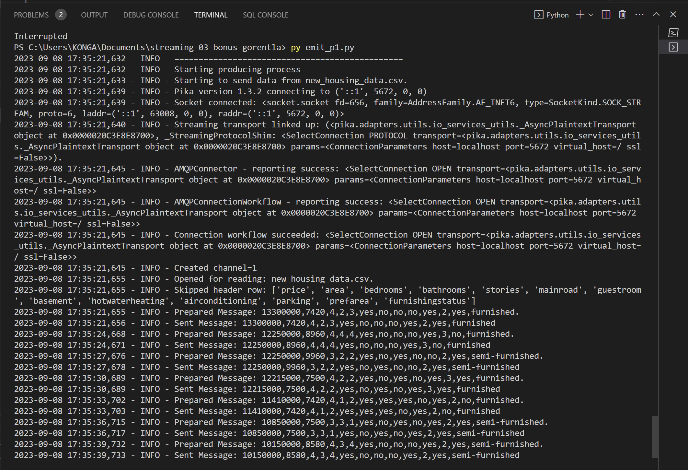
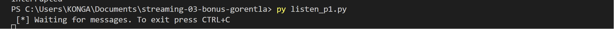

# streaming-03-bonus-gorentla
Priyanka Gorentla </br>
Module 3 bonus </br>

Original data is from Kaggle : https://www.kaggle.com/datasets/yasserh/housing-prices-dataset  </br>

## Prerequisites

1. Git
1. Python 3.7+ (3.11+ preferred)
1. VS Code Editor
1. VS Code Extension: Python (by Microsoft)
1. RabbitMQ Server installed and running locally

## Before You Begin

1. Fork this starter repo into your GitHub account.
1. Clone your repo down to your machine.
1. Explore your new project repo in VS Code on your local machine.

## Task 1. Create a Python Virtual Environment

We will create a local Python virtual environment to isolate our project's third-party dependencies from other projects.

1. Open a terminal window in VS Code.
1. Use the built-in Python utility venv to create a new virtual environment named `.venv` in the current directory.

```shell
python -m venv .venv
```
.
Verify you get a new .venv directory in your project. 
We use .venv as the name to keep it away from our project files. 

## Task 2. Activate the Virtual Environment

In the same VS Code terminal window, activate the virtual environment.

- On Windows, run: `.venv\Scripts\activate`
- On Linux/MacOS, run: `source .venv/bin/activate`

Verify you see the virtual environment name (.venv) in your terminal prompt.

## Task 3. Install Dependencies into the Virtual Environment

To work with RabbitMQ, we need to install the pika library.
A library is a collection of code that we can use in our own code.
Learning to use free libraries that others have written to make our projects easier, faster, more reliable is a key skill for a developer.

We keep the list of third-party libraries needed in a file named requirements.txt.
Use the pip utility to install the libraries listed in requirements.txt into our active virtual environment. 

Make sure you can see the .venv name in your terminal prompt before running this command.

`python -m pip install -r requirements.txt`

## Task 4. Getting one CSV file and doing required Process

1. I have choosen housing dataset.A simple yet challenging project, to predict the housing price based on certain factors like house area, bedrooms, furnished, nearness to mainroad, etc. The dataset is small yet, it's complexity arises due to the fact that it has strong multicollinearity.  </br>
2. Wrote one python code emit_p1 by taking reference of module 3 v2_emit_message.py and module 2 code for reading and updating csv file
3. listen_p1.py code is referenced from v2_listen_for_messages.py
4. Selling or giving to lease people are producers and buying people are consumers.

